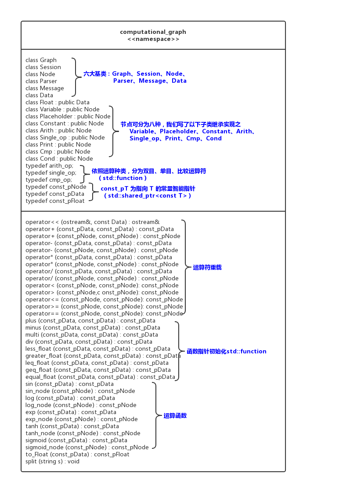
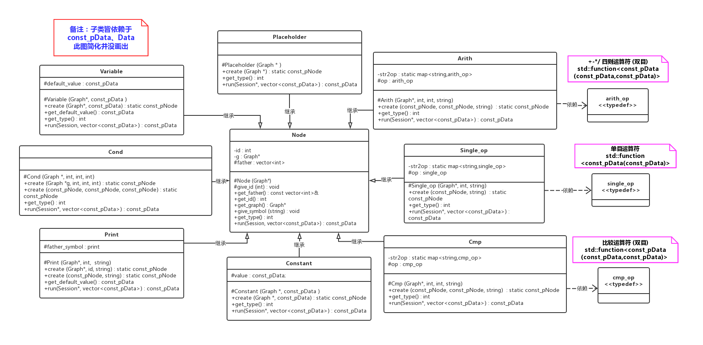

# 计算图第一阶段说明文档

## 整体结构、封装、接口
本次作业中, 我们写出了六大类: ```Graph```，```Session```, ```Node```,  ```Data```， ```Parser```， ```Message``` 以及若干派生类实现计算图的功能。 以下UML图给出了各类的相关关系以及接口。

(备注 : +代表public, #代表protected, -代表private）

### 命名空间 (UML-namspace.png)
我们本次所有类、函数都写于```computational_graph```的命名空间中, 於主函数调用


### 六大类 (UML-Base.png)


### Node以及其派生基类 (UML-Node.png)


### Data以及派生Float类 (UML-Data.png)


以上是我们所有的接口与函数, 现在我们就各个类探讨其功能，并给出相关注意事项。
