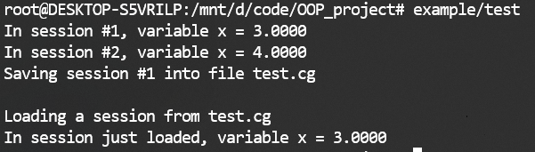
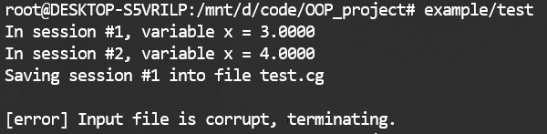

# 实验报告

小组成员：

于剑 2018011384 计84

张思源 2018011394 计85

周恩贤 2018011438 计86

## 1 介绍

在本次大作业第二阶段中，我们使用本组第一阶段的代码，并完成了所有基础需求和扩展需求，还实现了一些额外的功能，如日志，文件存取时的完整性检验等。

## 2 基础需求

* 为了实现新的节点类型`Assert`,`Bind`，我们加入了新的节点派生类。

* 为了实现自动求导，我们加入了`Grad`和`At`节点派生类，并将`Session`种实现的求值由记忆化DFS改为反向flood-fill后按拓扑序求值，方便`Grad`节点的实现。

* 实现了求导和`Assign`节点后，牛顿迭代法容易实现。

由于基础需求已在OJ上测试，在此不另外展示。

## 3 扩展需求

### 3.1 Assign节点

每次`Session`执行求值时，维护结束求值后需要进行的赋值操作，并在结束时统一进行。对外开放`Session::add_assign_task`接口。然后只需添加新节点派生类`Assign`

由于最小二乘法，牛顿迭代以及手写数字识别中使用了`Assign`节点，在此不再另外展示。

### 3.2 完整的自动求导功能

我们实现了各类运算的求导。

### 3.3 张量类数据

* 我们添加了`Data`的新派生类`Tensor`，用于张量的存储和运算。

* `Float`现在作为`Tensor`的派生类，满足`shape=()`
* 我们还添加了`Diff`派生类，将`shape`划分为两部分，用于存储求导结果
* `Matrix`则作为`Diff`的子类，只是为了方便调用而添加

`reshape`,`concat`,`broadcast`等也已实现，张量运算的求导也已实现。

相关测试在`example/test_tensor.cpp`中进行。

### 3.4 Session与存取功能

`Session`在第一阶段就已经实现。

为实现文件存取功能，我们实现了`FileReader`和`FileWriter`两个类，管理与文件的读写交互，还兼有Hash检验文件完整性的功能（在4.2中介绍）

文件的存取通过递归的方式进行。例如`Session`关联着`Graph`，还存放着变量的取值，则调用`Session`的`save`方法进行存储时会调用`Graph`和`Data`的`save`方法。所有存取都是通过二进制方法进行的。在每个类开始存储时，都会写入一个2字节的标识，以表明下面开始的数据段对应的数据类型。这也为含有多种派生类的类的存取（如`Data`和`Node`）提供了方便。

`example/test_sess.cpp`展示了这些功能，可以使用`make test_sess`编译，在`example`目录下得到可执行文件`test`。



### 3.5 多变量最小二乘法

对于多变量线性函数 $f(\vec{x}) = \sum_{i=1}^n k_i x_i + b$, 我们实现了梯度下降优化最小二乘法的功能。其测试程序（包含```Assign```的使用测试在```example\test_leastsqr.cpp```, 可利用```make leastsqr```编译生成```test.exe```进行测试。

过程与思路 : 令 $A_{m \times (n+1)} =  \left[\begin{matrix}x_{11} & ... & x_{1n}&1\\...&...&...&... \\ x_{m1}&... & x_{mn} &1\end{matrix} \right] $,  $\vec{k}= (k_1,...,k_n, b)^T$, $\vec{y} = (y_1,...,y_m)^T$ 

我们可将原问题转化为优化 $\vec{k}$ , 使得损失函数 $L(\vec\omega) = ||A\vec{k} - \vec{y}||_2^2$  最小 , 利用梯度下降法迭代求解 :

$$\vec{k}^{i+1} =  \vec{k}^i  -\eta \nabla L(\vec{k}^i)$$ , 其中 $\eta$ 为学习速度 , 迭代次数为$epoches$。

我们利用计算图将$A$以及 $\vec{y}$ 设为```Constant```, 将$\vec{k}$ 设为```Variable```。每次迭代计算$\nabla L(\vec{k})$, 并利用```Assign```运算进行$\vec{k}$的修改与输出。每次迭代输出结果即为优化后的 $\vec{k}$ , 每轮迭代就输出一次。最后再输出训练后函数、参数值、优化结果$$A\vec{k} - \vec{y}$$。初值设定 : $\vec{k}_0 = (1,1,1)^T$ ,  $\eta = 0.02,   epoches= 1500$。

输入格式 : 

+ 第一行输入一个正整数以及一个浮点数, 分别代表迭代次数$epoches$ 以及学习速度 $ \eta$
+ 第二行输入两个正整数，分别表示样点数目 $m$ 以及空间维数 $n$。
+ 接下来 $m$ 行, 每行 $n+1$ 个浮点数, 表示第 $i$ 个样本点的坐标 $(x_{i1},x_{i2},...,x_{in})$ 以及实际值 $(y_i)$

样例输入 (leastsqr.in):

```
1500 0.03
4 2
3 2 4
2 2 7
1 2 2
0 1 5
```

样例输出 

``` c++
f(x) = 0.999949 * x_1 + -2.66647 * x_2 + 7.6664

k[1] = 0.999949
k[2] = -2.66647
b = 7.6664

The optimization of A*k-y is :
[[1.3333], [-2.6667], [1.3334], [-0.0001]]
```

测试结果 : 


发现已趋于收敛, 更改初值为$\vec{k}_0 = (1, -2.6, 7.5)^T$ 再进行测试。


梯度下降得到的 $\vec{k}= (0.9999, -2.666, 7.666)^T$ , 优化结果$$A\vec{k} - \vec{y} = (1.333, -2.666,1.3334,-0.0001)^T$$

与最小二乘法的公式法 :  $\vec\omega = (A^TA)^{-1}A^Ty$  进行对比。编写$matlab$程序得到结果如下：


最小二乘得到的 $\vec{k}= (1, -8/3 , 22/3)^T$ ，优化结果$$A\vec{k} - \vec{y} = (4/3, -8/3, 4/3, 0)^T$$。 两者相符。

### 3.6 手写数字识别

由于时间问题，我们只实现了全连接网络。我们使用MNIST数据集进行训练和测试，建立各层节点数为`[784,100,10]`的全连接网络，使用`sigmoid`作为激活函数。

由于目前自动求导存在性能问题（见5.1），我们只能进行每个batch含一对训练数据的训练。同样由于性能问题，我们没能训练完成一个完整的epoch。训练出的网络参数保存在`MNIST/net1.cg`中，在含有10000个测试数据的测试集上测试的正确率为88.22%

* `MNIST/wrapper.cpp`用于处理训练集和测试集，调用3.4实现的存储功能存放在相应`.cg`文件中。
* `MNIST/train.cpp`从`mnist_training.cg`中读取训练集，训练时在`net.cg`中存档。
* `MNIST/test.cpp`中`mnist_test.cg`中读取测试集，从`net.cg`中读取神经网络，并进行测试。

## 4 一些额外功能

### 4.1 日志功能

实现了包含4个日志等级（```debug,info,warning,error```），并可以调整等级和输出流的日志接口`Message`类。

`Message`类没有实例，全部方法和成员均为静态

日志等级：`debug`, `info`, `warning`, `error`，分别对应Message类的不同接口。可通过`Message`类的接口调整日志等级。

日志输出：默认关联`std::cerr`，可通过`Message`类接口调整。

如：等级设为`warning`时，只有`warning`与`error`日志获得输出。

计算图的所有输出均通过`Message`类进行，方便统一管理。

```message```输出接口用于正常的输出内容，如```Print```节点的输出。

### 4.2 文件存取的完整性检验

`ByteStreamHash`实现了一个简单的RK-hash，提供了流操作符和`hash()`接口，用于对一个字节流进行hash。

利用这个hash，`FileReader`和`FileWriter`会进行文件完整性校验。具体来说，`FileWriter`会在析构关闭文件时向文件写入那些已写入的字节的hash值。而`FileReader`会在打开文件时首先校验hash值。

下面给出了3.4中文件遭到破坏时的测试。



## 5 可改进处

### 5.1 底层浮点数

目前底层标量运算时使用的浮点数为`double`，不能自定义。

### 5.2 求导的性能问题

目前求导得到的Jacobi矩阵大多十分稀疏，导致使用时空间占用极大，且计算很慢。目前打算实现一个类，用于记录这样的稀疏矩阵，仅记录那些不为0的位置，并优化运算效率。但由于时间问题，还未实现。