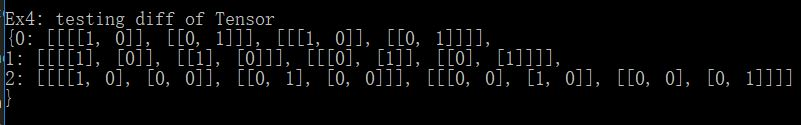

## 附加功能测试--Tensor 

我们完整实现了```Tensor```的运算以及求导功能。```Tensor```测试在```example_test_tensor```中, 可利用```make test2```编译生成```test2.exe```进行调试。在测试的过程除了用日志功能追踪错误外，因为 ```Tensor::to_string() ```的输出模式与和python格式相符，故可搭配python 的 IDE 一同测试。

以Ex4为例 , 假设我们想检查多维矩阵运算偏导功能，结果如下（因为输出结果是偏导```graddata```类，故有```index```记录着每个位置的偏导结果，每个```index```对应了一个多维矩阵）



直接在命令行中不方便调试，我们可复制至py中方便调试，方便检查各维、各元素是否计算正确


相关功能我们分别利用不同函数实现调试。相关测试与解释说明如下：

+ 四则运算 : ```example1()``` , 混合```Placeholder```、```Constant```节点及四则运算节点，过程中会```broadcast```检查形状是否匹配
+ 单目运算 : 见```example2()```, 在四则运算的基础下增加```sin```、```log```、```exp```、```tanh```、```sigmoid```等节点。
+ ```Reshape``` : 见```example3()```, 调用```Tensor::reshape(vector<int>)```进行测试
+ 偏导 : 见```example4()``` , 增加```Grad```以及```At```节点进行偏导运算

可在程序中修改```pair<vector<double>, vector<int>>```的值进行测试。另外, 我们也提供了```input_Tensor()```函数方便使用者按照输出的提示信息进行调试， 或是利用文件重定向的方式进行多组测资测试以及对拍。


## 附加功能测试-- Assign & 梯度下降优化最小二乘法

对于多变量线性函数 $f(\vec{x}) = \sum_{i=1}^n \omega_i x_i + b$, 我们实现了梯度下降优化最小二乘法的功能。测试程序为```example_gd.cpp```, 可利用```make_test3```编译生成```test3.exe```进行测试。样例输入如下 : 

+ 第一行输入两个正整数,  分别表示样点数目 $m$ 以及空间维数 $n$。
+ 接下来 $m$ 行, 每行 $n+1$ 个浮点数, 表示第 $i$ 个样本点的坐标 $(x_{i1},x_{i2},...,x_{in})$ 以及实际值 $(y_i)$

过程与思路 : 令 $A_{m \times (n+1)} =  \left[\begin{matrix}x_{11} & ... & x_{1n}&1\\...&...&...&... \\ x_{m1}&... & x_{mn} &1\end{matrix} \right] $,  $\vec\omega = (\omega_1,...,\omega_n, b)^T$, $\vec{y} = (y_1,...,y_m)^T$ 

我们可将原问题转化为优化 $\vec\omega$ , 使得损失函数 $L(\vec\omega) = ||A\vec\omega - \vec{y}||_2^2$  最小 , 利用梯度下降法迭代求解 :

$$\vec\omega^{i+1} =  \vec{\omega}^i  -\eta \nabla L(\vec{\omega}^i)$$ , 其中 $\eta$ 为学习速度 , 共迭代 t 次。


我们利用计算图将$A$以及 $\vec{y}$ 设为```Constant```, 将$\vec\omega$ 设为```Variable```, 利用```Assign```进行```Variable```的迭代修改与输出。输出结果即为优化后的 $\vec\omega$ , 每轮迭代就输出一次。初值设定 : $\hat\omega_0 = (1,1,...,1)$, $\eta = 0.1, t = 100$


利用随机生成的侧资 ```example_gd.in``` 计算至 ```example_gd.out``` 中 : 梯度下降得到的 $\vec\omega$ 为 :


与最小二乘法的公式法 :  $\vec\omega = (A^TA)^{-1}A^Ty$  进行对比。由公式法得到的 $\vec\omega = $


